# Alpecca Feature And Function Skeleton

Last reviewed: **2026-07-09**

Canonical status source: `docs/ALPECCA_MASTER_PLAN.md`.

## Legend

- Green: DONE - live, tested, runtime-verified, documented, and not security-blocked.
- Amber: PARTIAL - useful implementation exists but a required gate is open.
- Red: BLOCKED - unsafe to activate until remediation passes.
- Gray: NOT STARTED - no production implementation.
- Blue: PARKED - intentionally deferred experiment.
- Slate: SUPERSEDED - replaced claim or design.

```mermaid
flowchart TB
    classDef done fill:#27864a,stroke:#185c32,color:#ffffff;
    classDef partial fill:#f2a922,stroke:#9a6508,color:#172033;
    classDef blocked fill:#c83d4d,stroke:#7f1f2b,color:#ffffff;
    classDef notstarted fill:#9aa7b8,stroke:#5d6878,color:#ffffff;
    classDef parked fill:#3276c5,stroke:#184c88,color:#ffffff;

    A["ALPECCA: one local-first companion system"]:::partial
    A --> F["Foundation runtime"]:::partial
    F --> F1["FastAPI / WebSocket / SQLite"]:::partial
    F --> F2["Remote auth + tunnels"]:::blocked
    F --> F3["Singleton + active portal"]:::notstarted

    A --> C["Cognition + agency"]:::partial
    C --> C1["Soul seven-subagent arbitration"]:::done
    C --> C2["CoreMind turn loop"]:::partial
    C --> C3["Cue + commitment ledger"]:::notstarted
    C --> C4["External approvals"]:::blocked

    A --> M["Memory + Mindpage"]:::partial
    M --> M1["Keyword/FTS + embedding backfill"]:::partial
    M --> M2["Mindpage Layer A"]:::partial
    M --> M3["Conversation privacy partition"]:::blocked
    M --> M4["llama.cpp KV persistence"]:::parked

    A --> R["Recursive improvement + automation"]:::partial
    R --> R1["Selfmod / learning"]:::partial
    R --> R2["Routines / watchers"]:::partial
    R --> R3["Unified initiative budget"]:::complete
    R --> R4["Computer autonomy"]:::blocked

    A --> E["Experience + embodiment"]:::partial
    E --> E1["House HQ + virtual app"]:::partial
    E --> E2["V4 VRM + 74 spring joints"]:::partial
    E --> E3["Expression / gesture scheduler"]:::partial
    E --> E4["Locked design QA"]:::partial

    A --> P["Perception + communication"]:::partial
    P --> P1["TTS voice"]:::partial
    P --> P2["Image / file perception"]:::partial
    P --> P3["Audio perception"]:::partial
    P --> P4["Discord autonomy"]:::blocked
    P --> P5["Creator contact outbox"]:::notstarted

    A --> X["Cloud + continuity"]:::partial
    X --> X1["HF art/runtime assets"]:::partial
    X --> X2["ZeroGPU / notebook compute"]:::partial
    X --> X3["Cloudflare shell"]:::blocked
    X --> X4["Mindscape continuity"]:::blocked
```

## Hardware And Cloud Boundary

| Lane | Status | Rule |
|---|---|---|
| Local Windows host | Authoritative | Approximately 24 GB DDR4 and RTX 3050 Laptop 4 GB |
| Hugging Face ZeroGPU | Optional / ephemeral | Stateless bounded inference only; runtime hardware must be probed |
| Google notebook / Colab | Optional / ephemeral | Stateless bounded jobs only; capacity and uptime are not guaranteed |

The old 34 GB DDR5/H100 local-rig claim is superseded. Those labels refer only
to a cloud runtime when observed, never to the laptop or persistent capacity.

## Highest-Priority Blockers

1. Replace legacy channel file extraction with the common trusted ingress and
   scoped citation boundary.
2. Add expiring, connection-bound capability leases for camera, screen,
   microphone, and file use, including disconnect revocation.
3. Add provider/model-specific cloud consent and immutable egress receipts.
4. Separate Discord bridge service authentication from signed guest actor
   identity before enabling autonomous participation or voice.
5. Finish V4 motion, expression, grounding, and locked-design QA.

## Current V4 Embodiment Boundary

- Runtime body loads with 74 spring joints and 22 colliders.
- Preserve the locked adult 19-year-old, 5 ft 7 in / approximately 170 cm design.
- Open: 3D scale calibration, boot-sole grounding, stationary root motion,
  expression reset, one-shot gesture scheduling, hoodie collider tuning, hair and
  left X/bow clip fidelity, and front/3/4/side/back turntable QA.

## Verification

The complete acceptance gates and phase ordering live in
`docs/ALPECCA_MASTER_PLAN.md` and `docs/ALPECCA_MASTER_PLAN.pdf`.
