# Alpecca Feature & Function Skeleton (Tiered Infographic)

Last reviewed: 2026-07-09  
Canonical source stack: `PROJECT_CONTEXT.md`, `HANDOFF.md`, `docs/AGENTIC_ASSESSMENT.md`, `docs/ALPECCA_CURRENT_PROGRESS.md`.

## Legend

Green: Done  
Amber: Partially done / conditional  
Slate: Partially superseded by newer documentation/behavior  
Blue: Parked / intentionally deferred  
Gray: Not started

```mermaid
flowchart TB
    classDef done fill:#2e7d32,stroke:#1b5e20,color:#ffffff;
    classDef partial fill:#f9a825,stroke:#7f6000,color:#1a1a1a;
    classDef superseded fill:#546e7a,stroke:#263238,color:#ffffff;
    classDef parked fill:#1565c0,stroke:#0d47a1,color:#ffffff;
    classDef notstarted fill:#90a4ae,stroke:#546e7a,color:#ffffff;

    S0["ALPECCA CURRENT SKELETON (runtime + product surface)"]:::partial

    S0 --> T1["Tier 1: Foundation Runtime"]
    T1 --> T1A["Fast chat path + runtime status + stream routing"]:::done
    T1 --> T1B["Server orchestration, lifecycle, websocket"]:::done
    T1 --> T1C["Persistence: DB state, memories, state log, proposals"]:::done
    T1 --> T1D["Remote/auth gates and tunnel modes (auth solid; ngrok launch never captures URL)"]:::partial

    S0 --> T2["Tier 2: Interaction Agents"]
    T2 --> T2A["Soul seven-subagent loop"]:::done
    T2 --> T2B["Snapshot-driven focus dispatch + room motion"]:::done
    T2 --> T2C["Tool loop with bounded rounds and schema gate"]:::done
    T2 --> T2D["Tool mode control: keyword/smart/always"]:::done
    T2 --> T2E["Innate tools: memory/journal/status/plan/recall (bounded 7-tool offer; keyword-preferred selection keeps recall/plan reachable)"]:::done
    T2 --> T2F["Vision + computer use"]:::partial

    S0 --> T3["Tier 3: Memory System"]
    T3 --> T3A["Keyword recall (live chat default)"]:::done
    T3 --> T3B["Semantic backfill pipeline (idempotent)"]:::done
    T3 --> T3C["Bounded recall candidate scoring"]:::done
    T3 --> T3D["Embeddings on demand (offline-safe fallbacks)"]:::done
    T3 --> T3E["Mindpage layer A: pages, writeback, pressure"]:::done
    T3 --> T3F["Context budget shrink and pressure signal flow (adaptive: measures full request, reserves response capacity, commit-safe paging)"]:::done
    T3 --> T3G["Pagefile KV cache (llama.cpp save/restore)"]:::notstarted
    T3 --> T3H["Layer C mmap/memory-tier deep mode"]:::notstarted

    S0 --> T4["Tier 4: Agency Controls"]
    T4 --> T4A["Constrained pick for tie-break/live/proactive choice"]:::done
    T4 --> T4B["Deterministic fallback on parse failure"]:::done
    T4 --> T4C["Proposal-first world edits"]:::done
    T4 --> T4D["ASK_FIRST enforcement on execution"]:::done
    T4 --> T4E["Planner step cap + strict payload format"]:::done

    S0 --> T5["Tier 5: Automation"]
    T5 --> T5A["Routines table + poll loop + routes (create/toggle only; no DELETE route)"]:::partial
    T5 --> T5B["Watcher loop + scan-no-content policy"]:::done
    T5 --> T5C["Built-in routine kinds only (safe, existing functions)"]:::done
    T5 --> T5D["Consolidation + VACUUM routine (consolidation real; explicit vacuum() hook exists, not yet a scheduled routine kind)"]:::partial
    T5 --> T5E["MCP tool federation"]:::parked

    S0 --> T6["Tier 6: Studio & Experience Surface"]
    T6 --> T6A["House HQ 2D + WS sense/event pipeline"]:::done
    T6 --> T6B["Studio tooling: character sheet + prompt/image route"]:::done
    T6 --> T6C["VRM runtime page + grounding (works on feat/vrm-preview; unmerged to main)"]:::partial
    T6 --> T6D["VCS app pipeline + texture lab integration"]:::done
    T6 --> T6E["Asset-level 3D model/art iteration"]:::partial
    T6 --> T6F["VRoid source pass for base model and outfit corrections"]:::partial

    S0 --> T7["Tier 7: Voice / Periphery / Ops"]
    T7 --> T7A["Identity voice stack (f5/kokoro + defaults)"]:::done
    T7 --> T7B["Discord bridge and notification logic"]:::done
    T7 --> T7C["Desktop/app file/vision feature flags"]:::done
    T7 --> T7D["Cloud integration (optional: cloud/mirror/deep)"]:::partial
    T7 --> T7E["MCP/closed frameworks in new paths"]:::superseded

    S0 --> T8["Tier 8: Governance and Safety Envelope"]
    T8 --> T8A["Locked spelling and artifact rules (no art upload to Cloudflare)"]:::done
    T8 --> T8B["No default autonomous external side effects"]:::done
    T8 --> T8C["Deterministic/noise-hardened fallbacks"]:::done
    T8 --> T8D["Offline honesty and bounded behavior"]:::done
    T8 --> T8E["Legacy doc posture cleanup + archived stale docs"]:::done
```

## Honest completion evidence (selected)

- `config.py`: tool modes, backfill, planner, routines/watchers flags, model defaults and cloud/deep backends.
- `alpecca/mind.py`: core loop, tool-schema selection, constrained pick callers, proactive control, propose execution flow, memory pressure injection, mindpage history writeback.
- `alpecca/actions.py` + `alpecca/toolkit.py`: action surface and tool dispatch semantics.
- `alpecca/cognition.py`: proposal schema migration/payload column and execution decisions.
- `alpecca/planner.py`: bounded local planning path with strict JSON + one-retry contract.
- `alpecca/memory.py`: backfill routine with NULL-only idempotent embedding updates.
- `server.py`: background backfill tick, /routines routes, /mindpage/stats, /cognition/proposals, watch/task lifecycles.
- `alpecca/mindpage.py`: page table, pressure stats, recall, stub generation, writeback.
- `alpecca/routines.py` and `alpecca/watchers.py`: automation and safe observation feed.
- `tests/test_core.py`: regression coverage for tool modes, backfill, mindpage recall, planner execution gate, proposals, routines/watchers routes, and offline fallback behavior.

## Status by layer

- **Done:** foundation runtime, tool gating (keyword-preferred 7-tool offer), proposal governance, base memory upgrades, adaptive mindpage paging + FTS5 recall, stage 3 constrained decisions, planner safety gates, watchers, mindpage layer A, house/vcs surface routes.
- **Partial:** remote/tunnel modes, routines route surface, consolidation/VACUUM scheduling, VRM page merge status, vision/computer-use behavior, deep tier experiments, 3D model matching pass, and advanced automation composition.
- **Not started / blocked:** Layer B KV persistence, Layer C mmap/pagefile deep tier in production path, MCP auto-provisioning at runtime.
- **Superseded:** legacy "8B/qwen3-8b" references and earlier system reviews now replaced by current assessment docs.

## Verified audit corrections (2026-07-09, multi-subagent code audit; updated same day after the adaptive Mindpage pass)

Five concrete defects were found by parallel code audit. The 2026-07-09 adaptive Mindpage implementation resolved three of them:

1. **FIXED — Innate tool cap dropped recall.** The 7-tool offer is now preference-driven (`alpecca/mind.py` `_chat_tools_schema`): recall/plan/journal tools are guaranteed slots when the message mentions them, so `recall_page` is no longer silently unreachable with the planner on.
2. **OPEN — Routines have no DELETE route.** `/routines` supports list/create/toggle only; `tests/test_core.py` deletes rows via raw SQL. Routines can be disabled but never removed over HTTP.
3. **MOSTLY FIXED — VACUUM.** `alpecca/mindpage.py` `vacuum()` now exists as an explicit maintenance hook; it is not yet exposed as a scheduled routine kind, so T5D stays partial.
4. **OPEN — ngrok tunnel is a blind launch.** `app.py` `_start_tunnel` starts ngrok via bare `subprocess.Popen` and never captures the public URL; only the cloudflare path goes through `preview_mod.ensure`.
5. **FIXED — Pressure now drives shrink.** The adaptive Mindpage ledger measures the complete LLM request, reserves response capacity, and pages history commit-safely; pressure is grounded telemetry (Soul, prompts, cognition, WS, API, House HQ gauge), not just a surfaced number.

The same pass added FTS5 lexical recall (`alpecca/memory.py`), hot/warm/cold page tiers with maintenance, and a House HQ working-memory gauge. Layer B (llama.cpp slot persistence) and Layer C (OS pagefile/mmap) remain experimental and not activated.

Also noted: the planner is conservatively "partial" in the entire-project diagram (execution proposal-gated, minimal tool set) — that framing is kept; the "fast" chat tier serves background/subagent work only since live player chat is pinned to the reason tier (`server.py`); VRM page + grounding is fully wired but exists only on `feat/vrm-preview`, absent from `main`.

## Next 2-step verification

1. Run: `python -m pytest -q tests/test_core.py -q`
2. Run: `npm.cmd run house:build`
