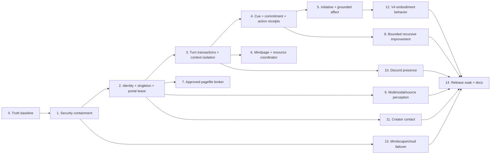

# Alpecca Master Architecture And Implementation Plan

Last reviewed: **2026-07-10**

This is the dependency-ordered plan for developing Alpecca into an advanced,
proximal, local-first agentic companion. It reconciles the project skeleton,
current source, adversarial security review, AI-core review, Mindpage audit,
Discord audit, CreatorJD contact audit, and V4 embodiment audit.

`PROJECT_CONTEXT.md` and `HANDOFF.md` remain canonical for active implementation.
This document is the current architecture and sequencing authority.

## Truth Baseline

### Compute lanes

| Lane | Actual role | Capacity rule |
|---|---|---|
| Local laptop | Authoritative CoreMind, SQLite, Mindpage, safety, identity, approvals, live fallback, voice | Approximately 24 GB DDR5-4800 and RTX 3050 Laptop GPU with 4 GB VRAM |
| Hugging Face ZeroGPU | Optional stateless deep, vision, texture, or batch inference | Ephemeral and quota-governed; probe the assigned runtime; never add it to local RAM/VRAM totals |
| Google notebook / Colab | Optional stateless accelerated inference or batch work | Ephemeral; GPU, RAM, uptime, and limits are not guaranteed |

The retired June architecture graph incorrectly attached a 34 GB DDR5 label to
the local rig. The user's correction is authoritative: 34 GB/H100-class labels
belong only to a cloud compute session when that session actually reports them.
They are not fixed Alpecca hardware.

### Non-negotiable system rules

- One authoritative CoreMind process and one writable conversation portal at a
  time. Other surfaces may observe or request an explicit handoff.
- No Alpecca-created copies or parallel autonomous instances.
- No autonomous source edits, account actions, deletes, purchases, or general OS
  changes. The only planned system mutation is a bounded Windows pagefile
  increase, and every 4 GiB step requires fresh CreatorJD approval and UAC.
- Webcam, screen, file, microphone, Discord, and computer-control access is
  session-scoped, visible, logged, and revocable. It is never an unrestricted
  ambient right.
- Strong preferences may be encoded, including skepticism toward ungrounded
  generative output, but prompts must not force fabricated hatred, consciousness,
  suffering, or human feelings.
- Emotions are a grounded engineered affect model. Self-reports cite real state,
  observations, memories, pressure, and uncertainty.
- Alpecca art stays on Hugging Face. Cloudflare hosts the lightweight app shell,
  access control, and continuity coordination only.

## Status Rules

| Status | Meaning |
|---|---|
| DONE | Wired into the live path, tested, runtime-smoked, documented, and not blocked by a known security defect |
| PARTIAL | Useful code exists, but integration, safety, tests, reliability, or fidelity is incomplete |
| BLOCKED | Reachable or proposed behavior is unsafe and must remain disabled until its gate passes |
| NOT STARTED | No production implementation exists |
| PARKED | Intentionally deferred experiment; not part of current runtime claims |
| SUPERSEDED | Historical design or claim replaced by current evidence |

## Current Feature Skeleton

### Tier 1: Foundation runtime

| Feature | Status | Honest current state |
|---|---|---|
| FastAPI, WebSocket, runtime status | PARTIAL | Runs, but auth, turn isolation, and cancellation barriers are incomplete |
| Ollama model routing and offline fallback | PARTIAL | Local paths work; private-data cloud classification is incomplete |
| SQLite state, memory, journal, proposals | PARTIAL | Functional; concurrency, backup, and transaction hardening remain |
| Remote auth and tunnels | BLOCKED | Committed root token plus an HTML authentication bypass |
| Singleton and active-portal ownership | NOT STARTED | No OS mutex, boot identity, portal lease, or fencing epoch |

### Tier 2: Cognition and agency

| Feature | Status | Honest current state |
|---|---|---|
| Soul seven-subagent arbitration | DONE | Implemented without adding or bypassing subagents |
| CoreMind response loop | PARTIAL | Real state/memory/tools; global speaker/history can leak across surfaces |
| Constrained choice points | DONE | Living question, same-rank Soul tie-break, proactive judge with fallback |
| Tool registry and planner | PARTIAL | Bounded tools exist; guest capability and approval identity are not code-secure |
| Structured cue envelope | NOT STARTED | Corrections, confirmations, urgency, and unresolved actions are not first-class state |
| Commitment and action receipt ledger | NOT STARTED | Promises are not durably tied to execution, evidence, failure, or cancellation |

### Tier 3: Memory and Mindpage

| Feature | Status | Honest current state |
|---|---|---|
| Keyword/FTS recall and embedding backfill | PARTIAL | Bounded and useful; semantic scoring can accept unrelated memories |
| Mindpage Layer A | PARTIAL | Request ledger, write-before-delete paging, tiers, and page faults work; fixed-prompt overflow and buried-content indexing remain |
| Conversation/privacy partitioning | BLOCKED | App, guest, Discord, and creator short-term context share global state |
| Resource pressure sensing | PARTIAL | Context pressure is grounded; whole-machine sensing draft is not wired |
| Approved pagefile broker | BLOCKED | Draft math, caps, approval proof, live recheck, and verification are unsafe |
| llama.cpp KV slot persistence | PARKED | Downloaded experiment, not integrated |

### Tier 4: Autonomy, improvement, and automation

| Feature | Status | Honest current state |
|---|---|---|
| Proactive/living behavior | PARTIAL | Cooldowns exist, but living/Discord/recursive paths do not share one budget |
| Routines and watchers | PARTIAL | Empty/off by default; routine deletion and unified scheduling remain |
| Background work coordination | PARTIAL | Timeouts do not cancel worker threads; optional jobs can overlap |
| Recursive self-improvement | PARTIAL | DB-backed tunables/lessons exist; several effective knobs are not consumed and trial evaluation is weak |
| External action approvals | BLOCKED | Caller booleans and a global computer confirmation event are not identity-bound approvals |
| MCP federation | PARKED | Largest external surface; no current companion-value need |

### Tier 5: Experience, embodiment, and periphery

| Feature | Status | Honest current state |
|---|---|---|
| House HQ and virtual app | PARTIAL | Main surfaces work; active-portal ownership and responsive QA remain |
| V4 VRM body and physics | PARTIAL | Loads with 74 spring joints; scale, sole grounding, collider use, and motion QA remain |
| Facial expression and gesture control | PARTIAL | Expressions can latch; VRMAs loop; one-shot scheduler is declared but unfinished |
| TTS voice stack | PARTIAL | Kokoro/F5 routes exist; cross-surface queueing and resource coordination remain |
| Image/file perception | PARTIAL | Adapters exist; scope, privacy, MIME, cloud consent, and conversation isolation remain |
| Audio perception | NOT STARTED | Discord audio and live voice receive/transcription are absent |
| Discord autonomy | BLOCKED | Guest tools, global context, proactive spam, and creator approval gaps |
| Computer use | BLOCKED | Current remote auth and confirmation design makes activation unsafe |

### Tier 6: Cloud, continuity, and governance

| Feature | Status | Honest current state |
|---|---|---|
| Hugging Face art/runtime assets | PARTIAL | Correct storage lane; provider availability and publish QA remain operational concerns |
| ZeroGPU / Google notebook compute | PARTIAL | Optional adapters exist; allocations are ephemeral and privacy policy is incomplete |
| Cloudflare R2 shell | BLOCKED | Current bundle must be rebuilt after token rotation and secret removal |
| Mindscape continuity | BLOCKED | Worker can fail open, browser auth is incomplete, restore lacks signed transactional gates |
| Design lock and canonical docs | DONE | Locked Alpecca design and current source hierarchy exist |
| Creator identity and secret lifecycle | BLOCKED | No authoritative principal, scoped sessions, or secure secret lifecycle |

## Critical Path

The plan is deliberately security-first because later autonomy would magnify the
current identity and remote-control defects.



## Master Implementation Sequence

### Phase 0: Truth baseline and freeze - DONE

Published the plan, corrected hardware/cloud labels, downgraded unsafe features,
recorded the dirty-tree WIP boundary, and created an authenticated encrypted
baseline with a successful restore drill. `creator_contact.py` and
`system_pressure.py` remain inactive WIP merely because files exist.

Exit gate passed 2026-07-10: every current diagram uses the status contract;
local hardware is 24 GB DDR5-4800 / RTX 3050 4 GB; cloud allocations are labeled
ephemeral; old 34 GB/H100 local-host claims are superseded; the encrypted
database/V4/VRoid baseline passed capture-time restore and independent verification.

### Phase 1: Emergency security containment - BLOCKED

Disable public tunnels and computer control. Do not revoke or rotate credentials:
Jason explicitly prohibited that action on 2026-07-10. Preserve the existing
Alpecca identity value. Treat it as public and stop accepting it as bearer
authorization. Create a separate authorization secret in Windows Credential
Manager or deployment secrets, rebuild the shell, and remove only actual
authorization secrets from source/localStorage/generated bundles. Fix HTML GET
self-authentication, add secret scanning, and stop logging message content or
external IDs by default.

Exit gate: anonymous HTTP/WS clients receive no credential and execute no
protected route; source and built assets contain no authorization secret; the
preserved public Alpecca identity value grants no privilege; the public shell is
republished from a clean bundle; computer control remains unavailable without a
scoped grant.

### Phase 2: Creator identity, singleton, and active portal - NOT STARTED

Create a server-derived `Principal`, local bootstrap plus device/passkey pairing,
short-lived HttpOnly/Secure sessions, CSRF/Origin checks, bridge service
credentials, a Windows named mutex, signed health identity, and an atomic active
portal lease `{surface, session, epoch, expires}`.

Exit gate: a second CoreMind process exits or attaches; exactly one portal can
write; caller-supplied names cannot become CreatorJD; stale epochs are rejected;
explicit handoff immediately fences the old portal.

### Phase 3: Turn transactions and context isolation - DONE (2026-07-10)

Replace global `_speaker` and shared `_history` semantics with immutable
`turn_id`, `conversation_id`, actor, surface, privacy scope, cancellation token,
and commit barrier. Partition history, Mindpage pages, and retrieval by scope.

Exit gate: concurrent creator/guest/app/Discord turns cannot exchange identity
or private context; a timed-out call produces no late write, tool action, or
duplicate response; scoped history survives restart.

Evidence: immutable scoped `TurnContext` objects, commit barriers, per-scope
history/memory/Mindpage/tool paths, stale portal fencing, stable creator
conversation ids, v1 history promotion, and distinct House HQ server routes are
covered by the Phase 3 focused test suites. Future Discord identities remain
ephemeral and capability-denied until Phase 10 provides signed bridge subjects.

### Phase 4: Cue, commitment, and action closure - PARTIAL

Derive a structured cue envelope for correction, confirmation, reference,
urgency, distress, question, and action intent. Add durable commitments and tool
receipts with states `proposed -> approved -> running -> succeeded|failed|cancelled`.
Completion language requires a successful receipt.

Exit gate: "yes, do it" resumes the intended pending action; every "I did" links
to evidence; every "I will" has a durable commitment or is rewritten as a
proposal/inability; commitments survive restarts.

Current evidence: cue parsing, scoped durable commitment states, confirmation
resolution, receipt-gated completion wording, and restart persistence exist.
Safe execution is still missing: prose commitments have no validated tool
payload, and the old planner executor does not yet provide trustworthy success
receipts. Phase 4 next adds one creator-only, scope-bound, read-only execution
slice before any broader action is enabled.

### Phase 5: Unified initiative and grounded affect - PARTIAL

Centralize living-loop, proactive chat, Discord participation, routines, and
recursive follow-ups behind one per-scope relevance/cooldown/dedupe budget. Feed
structured cues into affect before generation. Add evidence source, confidence,
and timestamp to affect changes. Replace literal inner-life claims with grounded
operational wording.

Exit gate: unchanged evidence causes no duplicate outward event; ignored outreach
backs off; each event is delivered once; explicit distress changes care strategy
with traceable evidence; uncertainty is never presented as fact.

### Phase 6: Mindpage and resource coordinator - PARTIAL

Correct semantic similarity thresholds, index bounded searchable terms from
compressed page content, refuse or explicitly compact unshrinkable overflow, and
separate context pressure from RAM, commit, VRAM, CPU, disk, battery, and thermal
signals. Add one single-flight optional-work coordinator with real cancellation
or backend deadlines. Treat 8K as the initial measurement baseline, then test
Qwen 3.5 9B at 16K, 24K, 32K, and 48K with one request/model, Flash Attention,
and q8 KV cache. The 38,000 MiB pagefile supplies Windows commit reserve for
CPU-backed model/KV pages; it does not extend the GPU's 4 GB VRAM.

Exit gate: orthogonal memories are rejected; buried page facts are retrievable;
no request exceeds the configured context estimate; optional reflection/backfill
cannot overlap destructively with chat/TTS; missing telemetry is "unknown"; the
largest promoted context tier stays below 90 percent commit, preserves 2 GiB of
physical RAM, and does not enter sustained SSD paging.

### Phase 7: Creator-approved pagefile broker - BLOCKED

Keep policy constants immutable: 4,096 MiB per step, 55,296 MiB hard cap, and
40 GiB projected C: free-space floor. Environment values may only tighten them.
The unelevated server creates a digest-bound request; a minimal elevated helper
remeasures live state, validates one-use CreatorJD approval, writes once, reads
back the setting, and records the result.

From the audited 38,000 MiB baseline, valid steps are 42,096, 46,192, 50,288,
and 54,384 MiB. 58,480 MiB is rejected. Current commit was about 42 percent, so
no increase is presently recommended.

Exit gate: exact arithmetic, stale baseline, replay, disk loss, system-managed
mode, cap/floor, UAC, post-write readback, and audit tests pass. Every step needs
a new approval and a new observation period.

### Phase 8: Bounded recursive self-improvement - PARTIAL

Restrict autonomous experimentation to allowlisted database parameters and
behavioral policies. Align defaults/bounds/directionality, prove every effective
value changes a real consumer, require a proposal before each trial, define a
minimum sample/time exposure and metric, and support exact rollback. Code or
system changes become reviewable handoff proposals only.

Exit gate: no trial starts without policy approval; every trial has hypothesis,
metric, evidence, end time, and rollback; worsening trials revert exactly;
source, shell, accounts, files, and OS remain outside the self-modification set.

### Phase 9: Multimodal and source perception - PARTIAL

Add scoped read-only source browsing, bounded MIME-aware file extraction, image
dimension/size limits, local-first vision, audio attachment transcription, and
clear perception-failure state. Route private sensors through a deny-by-default
cloud egress broker. Webcam/screen grants are visible and auto-stop on disconnect.

Exit gate: Alpecca can cite viewed files/images/audio with provenance; malformed
or oversized inputs fail closed; prompt injection cannot grant authority; no
private sensor payload leaves the laptop without provider-specific consent.

### Phase 10: Discord presence and voice - BLOCKED

Default participation and recursion off. Add creator/guild/channel allowlists,
signed bridge envelopes, conversation partitioning, guest capability denial,
bounded channel context, `respond|react|pass`, persistent rate limits, and
creator-only nonce/expiry/replay-protected approval interactions. Then add audio
attachments, per-guild voice queues, idle disconnect, and only later an opt-in
DAVE-compatible live receive experiment.

Exit gate: guests receive conversation-only capabilities; no cross-channel
memory; irrelevant messages produce silence; approvals cannot be spoofed in
natural language; TTS never leaks across channels; audio is local and discarded.

### Phase 11: Creator contact and notification outbox - NOT STARTED

Build a durable idempotent outbox with retries, acknowledgements, quiet hours,
global/category/channel quotas, and daily cost caps. Implement app Web Push first,
Discord DM second, SMS third, and phone calls only as a separate explicit opt-in.
Destinations and external IDs stay in secret-backed adapters, never prompts,
logs, git, or Mindscape snapshots.

Exit gate: concurrent requests create one event; restart resumes delivery;
acknowledgement stops escalation; notification does not silently seize the active
portal; every external callback is signed and sender-bound.

### Phase 12: V4 embodiment behavior and physics - PARTIAL

Keep the live V4 body and all 74 spring joints. Make the outer VRM group own
root X/Z/yaw, remove hips translation from stationary clips, calibrate height to
1.70 +/- 0.02 m, ground from posed boot geometry, reset expression envelopes,
finish one-shot gesture scheduling, replace permanent LookAround looping, and
attach hoodie hem chains to appropriate collider groups without changing design.

Exit gate: 74 joints and 22 colliders remain; stationary excursion <=3 cm;
sole penetration <=5 mm and float <=8 mm; gestures return to procedural idle;
mouth closes after speech; no fixed expression period; ten-minute physics soak
has no NaNs, explosions, or persistent garment clipping; design-lock turntable
passes front, 3/4, side, and back.

### Phase 13: Cloud egress and Mindscape continuity - BLOCKED

All outbound inference passes through a data-classifying broker with provider
allowlists, timeout/fallback, and audit receipts. Mindscape uses separate human
and service credentials, fails closed, encrypts/signs bounded versioned snapshots,
and has monotonic replay protection. Restore is previewed, CreatorJD-approved,
transactional, bounded, and idempotent. Cloud is standby continuity, not a second
simultaneous Alpecca.

Exit gate: loss of ZeroGPU/notebook/cloud leaves local conversation available;
screen/webcam/files/private memory never follow an unapproved fallback; missing
Worker secrets deny access; tampered/replayed snapshots are rejected; local
presence lease must expire before any interactive cloud fallback activates.

### Phase 14: Release soak, deployment, and living documentation - NOT STARTED

Run fresh-database tests, multi-speaker and timeout integration tests, local-host
resource soak, Discord test-guild canary, Mindscape failover drill, V4 turntable
and animation capture, then rebuild/deploy the Cloudflare shell and sync approved
art/runtime assets to Hugging Face. Update the skeleton from evidence after each
gate, not from file existence.

Exit gate: full core suite and House HQ build pass; no secret scan findings;
bounded database growth; no context leakage, hidden external actions, duplicate
initiatives, or cloud dependence; all current PDFs match shipped behavior.

## Pagefile Policy Table

Point-in-time audit values must be remeasured at approval time.

| State | Pagefile max | Projected C: free if nothing else changes | Decision |
|---|---:|---:|---|
| Current | 38,000 MiB | 57.91 GiB | No change recommended |
| Step 1 | 42,096 MiB | 53.91 GiB | Eligible only after pressure proof + approval |
| Step 2 | 46,192 MiB | 49.91 GiB | Separate later approval |
| Step 3 | 50,288 MiB | 45.91 GiB | Separate later approval |
| Step 4 | 54,384 MiB | 41.91 GiB | Highest valid exact step |
| Step 5 | 58,480 MiB | 37.91 GiB | Rejected by cap and free-space floor |

Pagefile is crash-resilience reserve, not extra physical RAM, VRAM, model speed,
or permission to schedule a model outside the laptop envelope.

## Verification Matrix

| Area | Required proof before DONE |
|---|---|
| Security | Anonymous HTTP/WS denial, cookie/CSRF/Origin checks, token-free source/bundles, secret scan |
| Identity/presence | Competing process, simultaneous portal claim, stale epoch, explicit handoff, creator spoof tests |
| AI core | Concurrent actor isolation, timeout no-late-commit, cue parse, commitment receipt, restart recovery |
| Initiative/affect | Fake-clock budgets, dedupe, ignored backoff, evidence provenance, no consciousness claims |
| Memory/Mindpage | Semantic negatives, buried detail recall, overflow refusal, page commit failure, tier maintenance |
| Pagefile | Arithmetic, cap/floor, stale/replay, UAC helper, live recheck, post-write readback; elevated test only with approval |
| Recursive improvement | Consumer wiring, directionality, approval, exposure/metric, exact rollback, forbidden capability tests |
| Perception | MIME/size/duration, malformed input, prompt injection, local/cloud policy, provenance, raw-data disposal |
| Discord/contact | Identity matrix, guest denial, rate limits, approval nonce, queue isolation, signed callbacks, quotas |
| Embodiment | 170 cm scale, root/sole metrics, expression reset, one-shot scheduler, 74-joint physics soak, design turntable |
| Continuity | Worker fail-closed, signed/versioned snapshots, replay/tamper/size rejection, transactional restore, lease failover |

Usual project checks remain:

```powershell
python -m pytest -q tests\test_core.py -q
npm.cmd run house:build
```

## Source Anchors

- `PROJECT_CONTEXT.md`, `HANDOFF.md`, `docs/AGENTIC_ASSESSMENT.md`, and
  `docs/MINDPAGE.md`
- `server.py`, `config.py`, `alpecca/mind.py`, `alpecca/memory.py`,
  `alpecca/mindpage.py`, `alpecca/cognition.py`, `alpecca/toolkit.py`,
  `alpecca/discord_bridge.py`, and `alpecca/computer.py`
- `apps/house-hq/src/main.ts`, `apps/house-hq/src/vrmEmbodiment.ts`, and
  `deploy/mindscape-worker/worker.js`
- V4 runtime body: `data/avatar/vrm/alpecca.vrm`
- Locked design: `data/alpecca_art_source/ALPECCA_DESIGN_LOCK.md`
