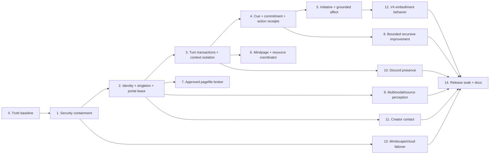

# Alpecca Master Architecture And Implementation Plan

Last reviewed: **2026-07-10**

This is the dependency-ordered plan for developing Alpecca into an advanced,
proximal, local-first agentic companion. It reconciles the project skeleton,
current source, adversarial security review, AI-core review, Mindpage audit,
Discord audit, CreatorJD contact audit, and V4 embodiment audit.

`PROJECT_CONTEXT.md` and `HANDOFF.md` remain canonical for active implementation.
This document is the current architecture and sequencing authority.

## Current Implementation Checkpoint (2026-07-10)

This checkpoint supersedes older route, access, and phase-status language
retained in the implementation sequence as historical planning context.

- `/house-hq` now serves the **Void Prototype**, with a native categorized
  **Alpecca Systems** center and an orthographic view.
- The old `web/home.html` is archived at
  `web/archive/house_hq_internal_legacy.html` and is no longer routed.
- Loopback access uses trusted-device bootstrap; remote access requires HTTPS
  creator trust. Remote trust establishes a protected Secure, HttpOnly session;
  plain LAN HTTP cannot enroll a creator device.
- Phase 4 baseline is complete with creator-only, scope-bound, read-only
  `self_status` commitment execution, receipt-backed closure, and replay
  protection. Broader action classes remain outside this baseline.
- Phase 5 baseline is complete: proactive speech, living ticks, and routines
  share one per-scope initiative budget; ignored outreach backs off; proactive
  delivery selects one surface; and eligible cue evidence changes response
  strategy with traceable provenance.
- Phase 6 Mindpage and resource coordination remains partial and active. Phase
  6A semantic-negative/orthogonal recall abstention and Phase 6B bounded
  sidecar content-term indexing are implemented and covered by focused tests.
  New pages index after durable commit; legacy pages support idempotent bounded
  backfill; content-only search does not inflate transcript blobs; and stats
  expose index coverage, errors, and capped pages. Legacy content-index
  backfill is idle-scheduled through the optional `backfill` coordinator at a
  300-second default interval. It remains silent and defers under chat, TTS,
  or other optional-work contention without losing its due state. Live-chat
  semantic recall remains disabled by default. Phase 6C refuses a fixed prompt
  overflow before model, tool, streaming, history, or memory work begins and
  returns an honest structured response; anti-repetition retries remeasure their
  expanded prompt and are skipped when they no longer fit. Phase 6D adds
  cooperative cancellation for embedding backfill, Mindpage content-index
  backfill, and routine embedding backfill. Chat or TTS foreground work cancels
  their leases; safe-boundary stops return `cancelled` or `cancel_requested`
  without claiming completion, advancing schedules, or broadcasting activity.
  Active LLM calls, TTS synthesis, reflection, and SQLite `VACUUM` are not
  force-cancelled.
- Phase 6E adds a read-only `HostResourceSampler`, exposed through
  `GET /system/resources`. Its machine-level host-pressure assessment is
  advisory-only and distinct from Mindpage's per-request context pressure.
  Phase 6F consumes only fresh advisory host pressure to defer optional
  maintenance before a coordinator lease. Chat and TTS behavior are unchanged,
  and unknown or unavailable host data allows work. It performs no automatic
  context reduction, pagefile action, configuration change, or system action.
- Phase 6G projects the cached shared host assessment into the Soul snapshot as
  separate `host_pressure` evidence. This is assessment-only, never raw host
  telemetry or advisory data; unknown, invalid, or unavailable data stays
  `null`. It makes no LLM or system call and does not change seven-agent Soul
  deliberation, urgency, or actions.
- Phase 6H adds an execute-only, read-only host preflight to the one-tier
  `scripts\measure_context_tier.py` harness. The default 8,192 dry run still
  uses no sampler and makes no request. On `--execute --tier N`, known high or
  critical host pressure, RAM/commit/disk headroom below fixed thresholds, or a
  low unplugged battery block the run before Ollama with zero HTTP requests.
  Unknown telemetry remains explicit and does not fabricate a block. `--all`
  remains rejected; reports never promote a tier or change configuration,
  pagefile, or system settings.
- On 2026-07-10, a real-machine execute invocation was blocked by critical host
  pressure before any Ollama request. No real `qwen3.5:9b` inference or
  context-tier measurement completed, and no tier was promoted.
- Phase 6 remains partial. The next gated action is to clear resources and
  re-run preflight, then separately authorize one 8,192 measurement; no direct
  pagefile mutation is authorized. See `docs/CONTEXT_TIER_MEASUREMENT.md` for
  the Phase 6E-6H contract.

## Truth Baseline

### Compute lanes

| Lane | Actual role | Capacity rule |
|---|---|---|
| Local laptop | Authoritative CoreMind, SQLite, Mindpage, safety, identity, approvals, live fallback, voice | Approximately 24 GB DDR5-4800 and RTX 3050 Laptop GPU with 4 GB VRAM |
| Hugging Face ZeroGPU | Optional stateless deep, vision, texture, or batch inference | Ephemeral and quota-governed; probe the assigned runtime; never add it to local RAM/VRAM totals |
| Google notebook / Colab | Optional stateless accelerated inference or batch work | Ephemeral; GPU, RAM, uptime, and limits are not guaranteed |

The retired June architecture graph incorrectly attached a 34 GB DDR5 label to
the local rig. The user's correction is authoritative: 34 GB/H100-class labels
belong only to a cloud compute session when that session actually reports them.
They are not fixed Alpecca hardware.

### Non-negotiable system rules

- One authoritative CoreMind process and one writable conversation portal at a
  time. Other surfaces may observe or request an explicit handoff.
- No Alpecca-created copies or parallel autonomous instances.
- No autonomous source edits, account actions, deletes, purchases, or general OS
  changes. The only planned system mutation is a bounded Windows pagefile
  increase, and every 4 GiB step requires fresh CreatorJD approval and UAC.
- Webcam, screen, file, microphone, Discord, and computer-control access is
  session-scoped, visible, logged, and revocable. It is never an unrestricted
  ambient right.
- Strong preferences may be encoded, including skepticism toward ungrounded
  generative output, but prompts must not force fabricated hatred, consciousness,
  suffering, or human feelings.
- Emotions are a grounded engineered affect model. Self-reports cite real state,
  observations, memories, pressure, and uncertainty.
- Alpecca art stays on Hugging Face. Cloudflare hosts the lightweight app shell,
  access control, and continuity coordination only.

## Status Rules

| Status | Meaning |
|---|---|
| DONE | Wired into the live path, tested, runtime-smoked, documented, and not blocked by a known security defect |
| BASELINE COMPLETE | The named minimum safe slice is wired and tested; broader phase expansion remains explicitly gated |
| PARTIAL | Useful code exists, but integration, safety, tests, reliability, or fidelity is incomplete |
| BLOCKED | Reachable or proposed behavior is unsafe and must remain disabled until its gate passes |
| NOT STARTED | No production implementation exists |
| PARKED | Intentionally deferred experiment; not part of current runtime claims |
| SUPERSEDED | Historical design or claim replaced by current evidence |

## Current Feature Skeleton

### Tier 1: Foundation runtime

| Feature | Status | Honest current state |
|---|---|---|
| FastAPI, WebSocket, runtime status | PARTIAL | Runs with protected authorization, immutable scoped turns, and cancellation/commit barriers; broader release hardening remains |
| Ollama model routing and offline fallback | PARTIAL | Local paths work; private-data cloud classification is incomplete |
| SQLite state, memory, journal, proposals | PARTIAL | Functional; concurrency, backup, and transaction hardening remain |
| Remote auth and tunnels | PARTIAL | Loopback uses trusted-device bootstrap; remote browsers establish creator trust and then use protected trusted-device sessions |
| Singleton and active-portal ownership | DONE | The process singleton and active portal epoch/fencing baseline are implemented |

### Tier 2: Cognition and agency

| Feature | Status | Honest current state |
|---|---|---|
| Soul seven-subagent arbitration | DONE | Implemented without adding or bypassing subagents |
| CoreMind response loop | PARTIAL | Real state/memory/tools now run through immutable scoped turn context; broader cognition work remains |
| Constrained choice points | DONE | Living question, same-rank Soul tie-break, proactive judge with fallback |
| Tool registry and planner | PARTIAL | Bounded tools exist; commitment execution currently allows only creator-scoped read-only `self_status` |
| Structured cue envelope | DONE | Corrections, confirmations, references, urgency, distress, questions, and action intent are first-class state |
| Commitment and action receipt ledger | BASELINE COMPLETE | Durable scoped commitments execute read-only `self_status` once, close from receipts, and reject replay |

### Tier 3: Memory and Mindpage

| Feature | Status | Honest current state |
|---|---|---|
| Keyword/FTS recall and embedding backfill | PARTIAL | Bounded and useful; Phase 6A rejects orthogonal and negative semantic matches, while live-chat semantic recall remains disabled by default |
| Mindpage Layer A | PARTIAL | Request ledger, write-before-delete paging, tiers, page faults, bounded sidecar content-term indexing, fixed-prompt overflow refusal, and cooperative maintenance cancellation work. Legacy index backfill is idle-scheduled; LLM calls, TTS synthesis, reflection, and VACUUM are not force-cancelled |
| Conversation/privacy partitioning | DONE | Creator app and House HQ turns are scope-partitioned; future guest/Discord subjects remain capability-denied until their later gates |
| Resource pressure sensing | PARTIAL | Read-only `HostResourceSampler` exposes host evidence through `GET /system/resources`; Phase 6F uses only fresh advisory host pressure to defer optional maintenance before a coordinator lease. Phase 6G separately projects the cached assessment into Soul `host_pressure`, never raw telemetry or advisory data; unknown stays `null`, it makes no LLM/system call, and it does not change seven-agent deliberation, urgency, or actions. Phase 6H adds an execute-only, read-only context-measurement preflight: known unsafe evidence blocks before HTTP, while unknowns remain explicit and do not fabricate a block. Chat and TTS are unchanged, and no automatic context reduction/pagefile/configuration/system action occurs |
| Approved pagefile broker | BLOCKED | Draft math, caps, approval proof, live recheck, and verification are unsafe |
| llama.cpp KV slot persistence | PARKED | Downloaded experiment, not integrated |

### Tier 4: Autonomy, improvement, and automation

| Feature | Status | Honest current state |
|---|---|---|
| Proactive/living behavior | BASELINE COMPLETE | Living ticks, proactive speech, and routines share one scoped budget; ignored outreach backs off and each proactive event selects one delivery surface |
| Routines and watchers | PARTIAL | Empty/off by default; routine deletion and unified scheduling remain |
| Background work coordination | PARTIAL | Timeouts do not cancel worker threads; optional jobs can overlap |
| Recursive self-improvement | PARTIAL | Phase 8A legacy `selfmod` remains evidence-only. Phase 8B provides an internal, approval-proof-backed controller for only `creator-personal` / `chatter_chance`, with exact apply/readback/rollback and startup recovery. C1 protects immutable specs and creator binding; C2-C4 provide aggregate-only attributed response evidence; C5/C6 provide explicit creator approval and start; C7 freezes planned-expiry evidence for read-only review. C8 adds one creator-only, bodyless proposal-namespaced registration action backed by a server-issued HMAC-sealed candidate from settled low-response baseline evidence. Registration cannot approve, start, or change behavior; generic Workshop payloads are not trial provenance. No trial runs by default, and evidence never triggers an automated behavior change. |
| External action approvals | BLOCKED | Creator-only scoped approval works for read-only `self_status`; external or mutating action classes remain blocked |
| MCP federation | PARKED | Largest external surface; no current companion-value need |

### Tier 5: Experience, embodiment, and periphery

| Feature | Status | Honest current state |
|---|---|---|
| House HQ and virtual app | PARTIAL | `/house-hq` serves the Void Prototype with a native categorized Alpecca Systems center and orthographic view; the old internal page is archived and unrouted |
| V4 VRM body and physics | PARTIAL | Loads with 74 spring joints; scale, sole grounding, collider use, and motion QA remain |
| Facial expression and gesture control | PARTIAL | Expressions can latch; VRMAs loop; one-shot scheduler is declared but unfinished |
| TTS voice stack | PARTIAL | Kokoro/F5 routes exist; cross-surface queueing and resource coordination remain |
| Image/file perception | PARTIAL | Adapters exist; scope, privacy, MIME, cloud consent, and conversation isolation remain |
| Audio perception | NOT STARTED | Discord audio and live voice receive/transcription are absent |
| Discord autonomy | BLOCKED | Guest tools, global context, proactive spam, and creator approval gaps |
| Computer use | BLOCKED | Current remote auth and confirmation design makes activation unsafe |

### Tier 6: Cloud, continuity, and governance

| Feature | Status | Honest current state |
|---|---|---|
| Hugging Face art/runtime assets | PARTIAL | Correct storage lane; provider availability and publish QA remain operational concerns |
| ZeroGPU / Google notebook compute | PARTIAL | Optional adapters exist; allocations are ephemeral and privacy policy is incomplete |
| Cloudflare R2 shell | BLOCKED | The shell still needs a release rebuild and protected-auth QA; Alpecca art remains excluded |
| Mindscape continuity | BLOCKED | Worker can fail open, browser auth is incomplete, restore lacks signed transactional gates |
| Design lock and canonical docs | DONE | Locked Alpecca design and current source hierarchy exist |
| Creator identity and secret lifecycle | PARTIAL | Server-derived creator identity, loopback bootstrap, and remote creator-trust sessions exist; broader pairing and lifecycle hardening remain |

## Critical Path

The plan remains security-first because later autonomy would magnify the
remaining identity-lifecycle and remote-control risks.



## Master Implementation Sequence

### Phase 0: Truth baseline and freeze - DONE

Published the plan, corrected hardware/cloud labels, downgraded unsafe features,
recorded the dirty-tree WIP boundary, and created an authenticated encrypted
baseline with a successful restore drill. `creator_contact.py` and
`system_pressure.py` remain inactive WIP merely because files exist.

Exit gate passed 2026-07-10: every current diagram uses the status contract;
local hardware is 24 GB DDR5-4800 / RTX 3050 4 GB; cloud allocations are labeled
ephemeral; old 34 GB/H100 local-host claims are superseded; the encrypted
database/V4/VRoid baseline passed capture-time restore and independent verification.

### Phase 1: Emergency security containment - PARTIAL

The authorization baseline now separates Alpecca's preserved public identity
from server authorization. Loopback browsers use trusted-device bootstrap;
remote browsers must establish creator trust before receiving a protected
trusted-device session. The pre-implementation HTML self-authentication path and
public-identity-as-bearer model are superseded. Computer control remains behind
its separate scope and approval gates.

Remaining containment work preserves the original target: do not revoke or
rotate the public Alpecca identity; keep actual authorization secrets out of
source, localStorage, URLs, and generated bundles; complete release secret scans
and safe logging checks before broader exposure.

Exit gate: anonymous HTTP/WS clients receive no credential and execute no
protected route; source and built assets contain no authorization secret; the
preserved public Alpecca identity value grants no privilege; the public shell is
republished from a clean bundle; computer control remains unavailable without a
scoped grant.

### Phase 2: Creator identity, singleton, and active portal - BASELINE COMPLETE (2026-07-10)

The baseline has a server-derived creator principal, loopback trusted-device
bootstrap, remote creator-trust enrollment, protected HttpOnly sessions,
CSRF/Origin checks, a process singleton, and one active WebSocket portal epoch
that fences its predecessor. Broader device/passkey pairing and bridge-service
identity remain future hardening and do not block the completed baseline.

Exit gate: a second CoreMind process exits or attaches; exactly one portal can
write; caller-supplied names cannot become CreatorJD; stale epochs are rejected;
explicit handoff immediately fences the old portal.

### Phase 3: Turn transactions and context isolation - DONE (2026-07-10)

Replace global `_speaker` and shared `_history` semantics with immutable
`turn_id`, `conversation_id`, actor, surface, privacy scope, cancellation token,
and commit barrier. Partition history, Mindpage pages, and retrieval by scope.

Exit gate: concurrent creator/guest/app/Discord turns cannot exchange identity
or private context; a timed-out call produces no late write, tool action, or
duplicate response; scoped history survives restart.

Evidence: immutable scoped `TurnContext` objects, commit barriers, per-scope
history/memory/Mindpage/tool paths, stale portal fencing, stable creator
conversation ids, v1 history promotion, and distinct House HQ server routes are
covered by the Phase 3 focused test suites. Future Discord identities remain
ephemeral and capability-denied until Phase 10 provides signed bridge subjects.

### Phase 4: Cue, commitment, and action closure - BASELINE COMPLETE (2026-07-10)

Derive a structured cue envelope for correction, confirmation, reference,
urgency, distress, question, and action intent. Add durable commitments and tool
receipts with states `proposed -> approved -> running -> succeeded|failed|cancelled`.
Completion language requires a successful receipt.

Exit gate: "yes, do it" resumes the intended pending action; every "I did" links
to evidence; every "I will" has a durable commitment or is rewritten as a
proposal/inability; commitments survive restarts.

Baseline evidence: cue parsing, scoped durable commitment states, confirmation
resolution, receipt-gated completion wording, and restart persistence exist.
The validated executor accepts only creator-approved, scope-bound, read-only
`self_status` commitments, records the execution receipt, and rejects replay.
Startup recovery closes an interrupted `running` record as `cancelled` without
rerunning its tool, and the unscoped legacy proposal execution route is retired.
Broader tools, mutation, and external action classes remain outside the Phase 4
baseline and require separate approval and gating.

### Phase 5: Unified initiative and grounded affect - BASELINE COMPLETE (2026-07-10)

Living ticks, proactive chat, and scheduled routines now reserve through one
per-scope relevance/cooldown/dedupe budget. Explicit user activity starts a quiet
period, unanswered outreach increases backoff, deferred work stops before side
effects, and proactive delivery selects the active portal or the external channel,
never both. Discord participation remains excluded until Phase 10.

Structured cues are confidence- and time-gated before generation. Eligible
distress evidence injects a calm support strategy with source, confidence, and
timestamp provenance while emotional `state_changed` remains false; weak or
unknown cues are metadata-only no-ops.

Exit gate: unchanged evidence causes no duplicate outward event; ignored outreach
backs off; each event is delivered once; explicit distress changes care strategy
with traceable evidence; uncertainty is never presented as fact.

Exit evidence: focused fake-clock and server integration tests cover cross-kind
cooldown, scope isolation, dedupe, quiet periods, ignored backoff, pre-side-effect
deferral, single-surface delivery, and prompt-visible grounded distress strategy.
Discord proactive participation, recursion, and voice default off until Phase 10.

### Phase 6: Mindpage and resource coordinator - PARTIAL (ACTIVE NEXT SLICE)

Phase 6A is implemented: semantic scoring rejects orthogonal and negative vector
matches. Phase 6B is also implemented: a bounded sidecar index stores content
terms after a page's durable commit; legacy pages support idempotent bounded
backfill; content-only retrieval selects candidates without inflating transcript
blobs; and Mindpage stats expose coverage, errors, and capped pages. Live-chat
semantic recall remains disabled by default.

Legacy content-index backfill is now idle-scheduled through the optional
`backfill` coordinator at a 300-second default interval. It remains silent and
defers under chat, TTS, or other optional-work contention without losing its
due state. Phase 6C now refuses a fixed request overflow before model, tool,
streaming, history, memory, or commitment work begins, returning an honest
structured response instead of a truncated request. Anti-repetition retries
remeasure their expanded prompt and are skipped when they no longer fit. Phase
6D adds cooperative cancellation for embedding backfill, Mindpage content-index
backfill, and routine embedding backfill. Foreground chat or TTS cancels their
leases; workers stop only at safe boundaries; and `cancelled` or
`cancel_requested` work is not recorded as completed, scheduled as successful,
or broadcast. Active LLM calls, TTS synthesis, reflection, and SQLite `VACUUM`
remain non-force-cancellable.

Phase 6E supplies read-only machine telemetry through `HostResourceSampler` and
`GET /system/resources`. It is explicitly separate from Mindpage context
pressure: host pressure is an advisory-only assessment of observed CPU, RAM,
commit, VRAM, disk, battery, and thermal signals, with unavailable probes kept
unknown. Phase 6F consumes only fresh advisory host pressure to defer optional
maintenance before a coordinator lease. Chat and TTS behavior are unchanged, and
unknown or unavailable host data allows work. It performs no automatic context
reduction, pagefile action, configuration change, or system action.

Phase 6G projects the cached shared host assessment into the Soul snapshot as
separate `host_pressure` evidence. The projection is assessment-only: it omits
raw host telemetry and advisory data, while unknown, invalid, or unavailable
data stays `null`. It is observational only: it makes no LLM or system call and
does not change seven-agent Soul deliberation, urgency, or actions.

Phase 6H makes the one-tier `scripts\measure_context_tier.py` host preflight
execute-only and read-only. Its default 8,192 dry run uses no sampler and makes
no request. On `--execute --tier N`, known high or critical host pressure,
RAM/commit/disk headroom below fixed thresholds, or a low unplugged battery
block before any Ollama HTTP request; unknown telemetry remains explicit and
does not fabricate a block. `--all` is rejected. The harness makes no automatic
promotion or configuration/system change, and every report requires manual
review before any later decision.

On 2026-07-10, a real-machine execute invocation was blocked by critical host
pressure before any Ollama request. No real `qwen3.5:9b` inference or
context-tier measurement completed, and no tier was promoted.

Phase 6 remains **PARTIAL**. The next gated action is to clear resources and
re-run preflight, then separately authorize one 8,192 measurement. Continue
separating context pressure from RAM, commit, VRAM, CPU, disk, battery, and
thermal signals. No direct pagefile mutation is authorized in Phase 6. The
38,000 MiB pagefile supplies Windows commit reserve for CPU-backed model/KV
pages; it does not extend the GPU's 4 GB VRAM.

Exit gate: orthogonal memories are rejected; buried page facts are retrievable;
no request exceeds the configured context estimate; optional reflection/backfill
cannot overlap destructively with chat/TTS; only fresh advisory host pressure can
defer optional maintenance before a coordinator lease; chat/TTS are unchanged;
the execute-only read-only preflight blocks known unsafe host pressure, below-
threshold headroom, and low unplugged battery before HTTP while preserving
explicit unknowns without fabricating a block; cached host assessment reaches
Soul only as assessment-only `host_pressure` evidence, with unknown data kept
`null` and no change to seven-agent deliberation, urgency, or actions; and no
automatic context reduction, pagefile, configuration, or system action occurs.
The largest promoted context tier stays below 90 percent commit, preserves 2 GiB
of physical RAM, and does not enter sustained SSD paging.

### Phase 7: Creator-approved pagefile broker - BLOCKED

Keep policy constants immutable: 4,096 MiB per step, 55,296 MiB hard cap, and
40 GiB projected C: free-space floor. Environment values may only tighten them.
The unelevated server creates a digest-bound request; a minimal elevated helper
remeasures live state, validates one-use CreatorJD approval, writes once, reads
back the setting, and records the result.

From the audited 38,000 MiB baseline, valid steps are 42,096, 46,192, 50,288,
and 54,384 MiB. 58,480 MiB is rejected. Current commit was about 42 percent, so
no increase is presently recommended.

Exit gate: exact arithmetic, stale baseline, replay, disk loss, system-managed
mode, cap/floor, UAC, post-write readback, and audit tests pass. Every step needs
a new approval and a new observation period.

### Phase 8: Bounded recursive self-improvement - PARTIAL

#### Phase 8A: Legacy autonomy containment

The legacy `selfmod` autonomous mutation/evaluation loop is contained. Idle
lessons remain evidence and create or refresh one bounded creator-review card,
but CoreMind does not start or evaluate a `selfmod` trial. Existing `selfmod`
history remains evidence only. Not all legacy tunables are proven to have a
runtime consumer.

`proactive.should_chatter` now has a validated opt-in `chance` override seam.
It does not bypass the existing eligibility gates. The internal Phase 8B
controller supplies its override only after the startup recovery gate succeeds,
and CoreMind consumes it only after that recovery. No real behavior trial has
started.

#### Phase 8B: Internal approval-proof-backed behavior trial controller

An **INTERNAL** approval-proof-backed `BehaviorTrialController` exists solely
for `creator-personal` / `chatter_chance`. SQLite enforces at most one active
`approved` or `running` trial. Its runtime-only SQLite override supports
apply/readback/rollback, automatic expiry rollback, and a startup recovery gate;
CoreMind consumes that override only after successful recovery.

This is not an authenticated creator approval flow. It must not be described as
creator-approved, and it does not satisfy the Phase 8 exit gate.

#### Phase 8C1: Spec integrity, creator binding, and status read - PARTIAL

Phase 8C1 keeps all Phase 8 partial. The generic ledger
retains immutable specifications and the exact SHA-256 of each raw persisted
specification. For `creator-personal` / `chatter_chance`, the behavior
controller has a creator-only binding sidecar HMAC-sealed in memory with the
existing protected server authorization secret; runtime consumption of its
override requires that binding and successful startup recovery. The chatter
supplier is read-only and fails closed; recovery-gated server maintenance
outside `mind_lock` receipts expired or invalid runtime records.

`GET /behavior-trials/status` is creator-only and read-only, returns
`Cache-Control: no-store`, and is unavailable before recovery completes. At
the C1 scope there were no behavior-trial start, approval, or mutation routes,
no metric collector or completion loop, and no real trial running. The
controller's internal creator-binding method was not an HTTP approval flow.

#### Phase 8C2: Durable qualified-response outcomes - COMPLETE, OBSERVATIONAL ONLY

`alpecca.qualified_response_ledger` now records the server-owned
`qualified_response_rate` evidence contract before C6 introduced a creator
start route. A row starts as a provisional dispatch before a portal send. It
becomes an eligible exposure only after the WebSocket/House HQ portal confirms
delivery. Only a typed `ProactiveCandidate(origin="chatter")` with an allowed
initiative can request that path; mood speech, routines, channel delivery,
queues, failed sends, and direct replies do not enter the denominator.

An authenticated, contentful, non-background creator WebSocket turn can match
only the oldest unexpired provisional or pending exposure in its exact durable
scope and surface. A response racing the send remains provisional until the
send is confirmed. Confirmed unanswered rows expire to `unanswered`; stale
provisional rows expire to `cancelled` and never count. The ledger stores
server-generated IDs and timestamps only, not message text, file data,
credentials, request IDs, client timestamps, or caller-provided scores.

`GET /behavior-trials/status` exposes aggregate-only baseline/trial outcome
evidence after recovery. No behavior trial has started, so all collected rows
are baseline evidence. This evidence layer itself did not authorize a start or
approval route, behavior mutation, autonomous completion, or evaluation.

#### Phase 8C3: Fixed per-trial evaluation contract - COMPLETE, NOT YET ACTUATED

`QualifiedResponseLedger.trial_summary(trial_id)` provides one server-owned
trial-id cohort's aggregate-only evidence without delivery, response-turn,
scope, or message identifiers. `behavior_trial_evaluation` is a pure reader of
that snapshot plus the exact persisted trial record: it verifies the metric
name/version, trial identity, spec SHA-256, count arithmetic, rate arithmetic,
baseline, and minimum sample count. It reports only `collecting`,
`awaiting_settlement`, or `ready_for_creator_review`; once ready it describes
the rate as `improved`, `unchanged`, or `worse` relative to the immutable
baseline and always requires creator review.

The contract performs no I/O or trial-state change. It does not start,
complete, evaluate-to-action, approve, or roll back a trial. C4 feeds it a
verified cohort; C5/C6 supply approval/start and C7 stores its fixed result in
a durable settlement, never as an automatic action.

#### Phase 8C4: Verified running-trial outcome attribution - COMPLETE, DORMANT

The server now asks `BehaviorTrialController.active_outcome_trial_id()` before
it records an eligible proactive dispatch. That reader is query-only and fails
closed unless the runtime override, HMAC-backed creator binding, immutable
preimage, supported `chatter_chance` parameter, `qualified_response_rate`
metric, and planned-end check all succeed at the exact server-owned dispatch
timestamp. Only then does the durable outcome ledger receive that trial id;
otherwise the row remains baseline-only. The server keeps this read outside
`mind_lock`, and controller/read failures cannot block delivery.

No behavior trial is running by default, so this path is dormant in normal use.
C4 itself does not create an approval, start, completion, evaluation-action, or
mutation route. It only ensures that a later controlled running trial will not
mix its evidence with baseline rows or an unrelated metric.

#### Phase 8C5: Creator-triggered approval - COMPLETE, APPROVAL ONLY

`POST /behavior-trials/{trial_id}/approve` was the first public behavior-trial
mutation route. It is creator-only, recovery-gated, and `Cache-Control: no-store`; it
has no request body and accepts no browser-provided proof, principal,
authorization mechanism, or timestamp. The server derives all approval facts
from its protected `AuthDecision` and its own clock, then calls the existing
controller against the exact registered trial. Responses expose a sanitized
trial summary only and omit approval proof material.

After durable approval the server writes a content-free
`CognitionObservation`. Audit failure cannot retry or widen approval and cannot
start the trial. Missing, invalid, terminal, unrecovered, or storage-failed
requests fail closed. This route cannot register, start, complete, roll back,
or apply a runtime override; a creator's approval alone changes no live
Alpecca behavior.

#### Phase 8C6: Creator-triggered start - COMPLETE, EXPLICIT START ONLY

`POST /behavior-trials/{trial_id}/start` is creator-only, recovery-gated, and
`Cache-Control: no-store`. It starts an already approved trial; a retry for the
same running trial is idempotent and re-verifies its binding. It has no request
body, ignores browser-provided timing or runtime values, and uses only server
time. The underlying controller verifies the HMAC-backed
creator binding, exact immutable preimage, one-active-trial policy, runtime
apply/readback, and approved-to-running transition atomically.

After a new durable start the server writes a content-free
`CognitionObservation`; an idempotent running retry writes none. Missing,
invalid, registered, terminal, unrecovered, or storage-failed requests fail
closed. This route cannot register, approve, complete, roll back, or pass
arbitrary runtime values. A C6 start is explicit; approval alone never
activates a trial and no background path can start one.

#### Phase 8C7: Frozen closure settlement and creator review - COMPLETE, NO RETUNING

After the existing off-lock controller maintenance has restored the exact
baseline and recorded a valid planned-expiry rollback, C7 waits for every
attributed qualified-response window to settle. It then reads the closed trial
and its aggregate evidence in one SQLite transaction, verifies the immutable
raw-spec digest and closure contract, applies the fixed C3 evaluation, and
persists canonical evidence/review JSON plus SHA-256 fingerprints. A SQLite
trigger refuses any new trial outcome after settlement, making later review
reads stable.

Settlement runs outside `mind_lock`, records a content-free
`CognitionObservation`, and can only produce `ready_for_creator_review` or
`inconclusive_insufficient_samples`. It cannot start, extend, complete,
rollback, approve, or retune a trial. `GET /behavior-trials/{trial_id}/review`
is creator-only, recovery-gated, and `no-store`; it returns the frozen evidence
only. `GET /behavior-trials/status` lists recent settlements, and the Workshop
shows baseline observation plus the latest settled result with no behavior
change control.

#### Phase 8C8: Sealed proposal-to-trial registration - COMPLETE, REGISTRATION ONLY

The server may issue one visible candidate only after settled baseline evidence
has at least five completed outcomes, no outstanding delivery windows, a
non-zero qualified-response rate below the fixed low-response threshold, and a
valid current `chatter_chance` preimage. The candidate is created alongside its
Workshop proposal in one SQLite transaction. It snapshots the baseline rate,
preimage, and bounded trial value, binds an immutable proposal snapshot, and
HMAC-seals both with the protected server authorization secret. It never reads
the generic Workshop proposal payload as a trial specification.

`POST /behavior-trials/proposals/{proposal_id}/register` is creator-only,
recovery-gated, bodyless, and `no-store`. It validates the sealed candidate into
the one supported `creator-personal` / `chatter_chance` /
`qualified_response_rate` specification and calls only registration. The
candidate stores a separate creator-authenticated registration receipt; repeated
calls return the same immutable ledger record. Concurrent identical ledger
registrations serialize to that same record. Registration cannot approve, start,
complete, roll back, or apply a runtime override.

The Workshop keeps `Accept plan`, `Register trial`, `Approve trial`, and `Start
trial` as separate controls with separate confirmations. Generic proposal
acceptance is not treated as behavior-trial approval. C5 approval and C6 start
remain the only later activation steps; no trial is running by default.

The remaining Phase 8C gap is a separate creator decision after frozen review.
Any real trial must be reviewable against its hypothesis, exposure window,
evidence, end time, and exact rollback. Code or system changes remain reviewable
handoff proposals only.

Exit gate remains unmet: it requires a registered fixed hypothesis from a
bounded proposal path and a separate creator decision after the frozen review;
worsening or inconclusive results must leave the baseline unchanged; startup
must recover interrupted runtime-only state; and source, shell, accounts,
files, and OS must remain outside the self-modification set.

### Phase 9: Multimodal and source perception - PARTIAL

Add scoped read-only source browsing, bounded MIME-aware file extraction, image
dimension/size limits, local-first vision, audio attachment transcription, and
clear perception-failure state. Route private sensors through a deny-by-default
cloud egress broker. Webcam/screen grants are visible and auto-stop on disconnect.

Exit gate: Alpecca can cite viewed files/images/audio with provenance; malformed
or oversized inputs fail closed; prompt injection cannot grant authority; no
private sensor payload leaves the laptop without provider-specific consent.

### Phase 10: Discord presence and voice - BLOCKED

Default participation and recursion off. Add creator/guild/channel allowlists,
signed bridge envelopes, conversation partitioning, guest capability denial,
bounded channel context, `respond|react|pass`, persistent rate limits, and
creator-only nonce/expiry/replay-protected approval interactions. Then add audio
attachments, per-guild voice queues, idle disconnect, and only later an opt-in
DAVE-compatible live receive experiment.

Exit gate: guests receive conversation-only capabilities; no cross-channel
memory; irrelevant messages produce silence; approvals cannot be spoofed in
natural language; TTS never leaks across channels; audio is local and discarded.

### Phase 11: Creator contact and notification outbox - NOT STARTED

Build a durable idempotent outbox with retries, acknowledgements, quiet hours,
global/category/channel quotas, and daily cost caps. Implement app Web Push first,
Discord DM second, SMS third, and phone calls only as a separate explicit opt-in.
Destinations and external IDs stay in secret-backed adapters, never prompts,
logs, git, or Mindscape snapshots.

Exit gate: concurrent requests create one event; restart resumes delivery;
acknowledgement stops escalation; notification does not silently seize the active
portal; every external callback is signed and sender-bound.

### Phase 12: V4 embodiment behavior and physics - PARTIAL

Keep the live V4 body and all 74 spring joints. Make the outer VRM group own
root X/Z/yaw, remove hips translation from stationary clips, calibrate height to
1.70 +/- 0.02 m, ground from posed boot geometry, reset expression envelopes,
finish one-shot gesture scheduling, replace permanent LookAround looping, and
attach hoodie hem chains to appropriate collider groups without changing design.

Exit gate: 74 joints and 22 colliders remain; stationary excursion <=3 cm;
sole penetration <=5 mm and float <=8 mm; gestures return to procedural idle;
mouth closes after speech; no fixed expression period; ten-minute physics soak
has no NaNs, explosions, or persistent garment clipping; design-lock turntable
passes front, 3/4, side, and back.

### Phase 13: Cloud egress and Mindscape continuity - BLOCKED

All outbound inference passes through a data-classifying broker with provider
allowlists, timeout/fallback, and audit receipts. Mindscape uses separate human
and service credentials, fails closed, encrypts/signs bounded versioned snapshots,
and has monotonic replay protection. Restore is previewed, CreatorJD-approved,
transactional, bounded, and idempotent. Cloud is standby continuity, not a second
simultaneous Alpecca.

Exit gate: loss of ZeroGPU/notebook/cloud leaves local conversation available;
screen/webcam/files/private memory never follow an unapproved fallback; missing
Worker secrets deny access; tampered/replayed snapshots are rejected; local
presence lease must expire before any interactive cloud fallback activates.

### Phase 14: Release soak, deployment, and living documentation - NOT STARTED

Run fresh-database tests, multi-speaker and timeout integration tests, local-host
resource soak, Discord test-guild canary, Mindscape failover drill, V4 turntable
and animation capture, then rebuild/deploy the Cloudflare shell and sync approved
art/runtime assets to Hugging Face. Update the skeleton from evidence after each
gate, not from file existence.

Exit gate: full core suite and House HQ build pass; no secret scan findings;
bounded database growth; no context leakage, hidden external actions, duplicate
initiatives, or cloud dependence; all current PDFs match shipped behavior.

## Pagefile Policy Table

Point-in-time audit values must be remeasured at approval time.

| State | Pagefile max | Projected C: free if nothing else changes | Decision |
|---|---:|---:|---|
| Current | 38,000 MiB | 57.91 GiB | No change recommended |
| Step 1 | 42,096 MiB | 53.91 GiB | Eligible only after pressure proof + approval |
| Step 2 | 46,192 MiB | 49.91 GiB | Separate later approval |
| Step 3 | 50,288 MiB | 45.91 GiB | Separate later approval |
| Step 4 | 54,384 MiB | 41.91 GiB | Highest valid exact step |
| Step 5 | 58,480 MiB | 37.91 GiB | Rejected by cap and free-space floor |

Pagefile is crash-resilience reserve, not extra physical RAM, VRAM, model speed,
or permission to schedule a model outside the laptop envelope.

## Verification Matrix

| Area | Required proof before DONE |
|---|---|
| Security | Anonymous HTTP/WS denial, cookie/CSRF/Origin checks, authorization-secret-free source/bundles, secret scan |
| Identity/presence | Competing process, simultaneous portal claim, stale epoch, explicit handoff, creator spoof tests |
| AI core | Concurrent actor isolation, timeout no-late-commit, cue parse, creator/scope enforcement, read-only `self_status` receipt, replay rejection, restart recovery |
| Initiative/affect | Fake-clock budgets, dedupe, ignored backoff, evidence provenance, no consciousness claims |
| Memory/Mindpage | Semantic negatives, buried detail recall, overflow refusal, page commit failure, tier maintenance |
| Pagefile | Arithmetic, cap/floor, stale/replay, UAC helper, live recheck, post-write readback; elevated test only with approval |
| Recursive improvement | Consumer wiring, directionality, approval, exposure/metric, exact rollback, forbidden capability tests |
| Perception | MIME/size/duration, malformed input, prompt injection, local/cloud policy, provenance, raw-data disposal |
| Discord/contact | Identity matrix, guest denial, rate limits, approval nonce, queue isolation, signed callbacks, quotas |
| Embodiment | 170 cm scale, root/sole metrics, expression reset, one-shot scheduler, 74-joint physics soak, design turntable |
| Continuity | Worker fail-closed, signed/versioned snapshots, replay/tamper/size rejection, transactional restore, lease failover |

Usual project checks remain:

```powershell
python -m pytest -q tests\test_core.py -q
npm.cmd run house:build
```

## Source Anchors

- `PROJECT_CONTEXT.md`, `HANDOFF.md`, `docs/AGENTIC_ASSESSMENT.md`, and
  `docs/MINDPAGE.md`
- `server.py`, `config.py`, `alpecca/mind.py`, `alpecca/memory.py`,
  `alpecca/mindpage.py`, `alpecca/cognition.py`, `alpecca/toolkit.py`,
  `alpecca/discord_bridge.py`, and `alpecca/computer.py`
- `apps/house-hq/src/main.ts`, `apps/house-hq/src/vrmEmbodiment.ts`, and
  `deploy/mindscape-worker/worker.js`
- V4 runtime body: `data/avatar/vrm/alpecca.vrm`
- Locked design: `data/alpecca_art_source/ALPECCA_DESIGN_LOCK.md`
